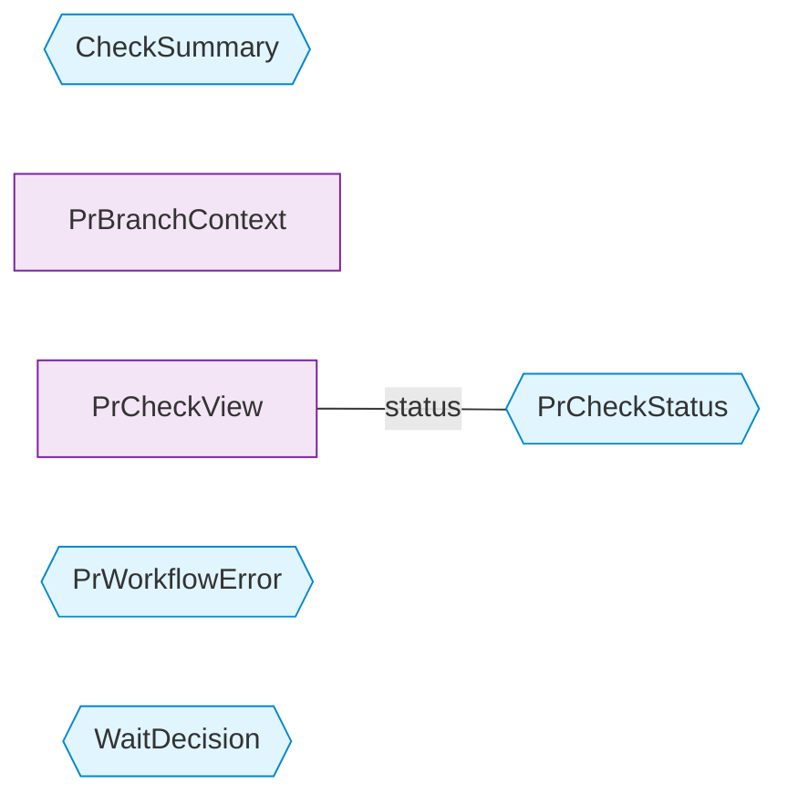

<!-- Generated from usecase::pr_workflow cluster TypeGraph — DO NOT EDIT DIRECTLY -->
# usecase::pr_workflow Type Graph

Types: 6 in cluster, 1 intra-cluster edges

```mermaid
flowchart LR
    classDef structNode fill:#f3e5f5,stroke:#7b1fa2
    classDef enumNode fill:#e1f5fe,stroke:#0288d1
    classDef ghostNode fill:#f5f5f5,stroke:#9e9e9e,color:#757575

    CheckSummary{{CheckSummary}}:::enumNode
    PrBranchContext[PrBranchContext]:::structNode
    PrCheckStatus{{PrCheckStatus}}:::enumNode
    PrCheckView[PrCheckView]:::structNode
    PrWorkflowError{{PrWorkflowError}}:::enumNode
    WaitDecision{{WaitDecision}}:::enumNode

    PrCheckView ---|status| PrCheckStatus
```
