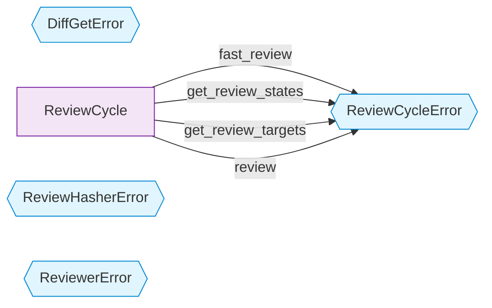

<!-- Generated from usecase::review_v2 cluster TypeGraph — DO NOT EDIT DIRECTLY -->
# usecase::review_v2 Type Graph

Types: 5 in cluster, 4 intra-cluster edges

```mermaid
flowchart LR
    classDef structNode fill:#f3e5f5,stroke:#7b1fa2
    classDef enumNode fill:#e1f5fe,stroke:#0288d1
    classDef ghostNode fill:#f5f5f5,stroke:#9e9e9e,color:#757575

    DiffGetError{{DiffGetError}}:::enumNode
    ReviewCycle[ReviewCycle]:::structNode
    ReviewCycleError{{ReviewCycleError}}:::enumNode
    ReviewHasherError{{ReviewHasherError}}:::enumNode
    ReviewerError{{ReviewerError}}:::enumNode

    ReviewCycle -->|fast_review| ReviewCycleError
    ReviewCycle -->|get_review_states| ReviewCycleError
    ReviewCycle -->|get_review_targets| ReviewCycleError
    ReviewCycle -->|review| ReviewCycleError
```
