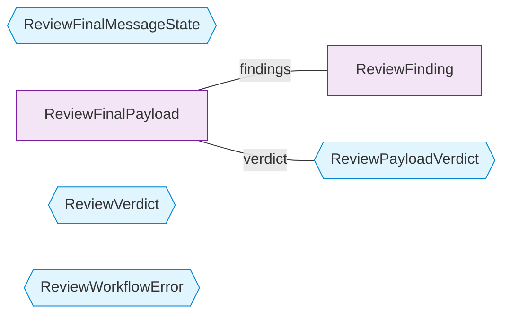

<!-- Generated from usecase::review_workflow cluster TypeGraph — DO NOT EDIT DIRECTLY -->
# usecase::review_workflow Type Graph

Types: 6 in cluster, 2 intra-cluster edges

```mermaid
flowchart LR
    classDef structNode fill:#f3e5f5,stroke:#7b1fa2
    classDef enumNode fill:#e1f5fe,stroke:#0288d1
    classDef ghostNode fill:#f5f5f5,stroke:#9e9e9e,color:#757575

    ReviewFinalMessageState{{ReviewFinalMessageState}}:::enumNode
    ReviewFinalPayload[ReviewFinalPayload]:::structNode
    ReviewFinding[ReviewFinding]:::structNode
    ReviewPayloadVerdict{{ReviewPayloadVerdict}}:::enumNode
    ReviewVerdict{{ReviewVerdict}}:::enumNode
    ReviewWorkflowError{{ReviewWorkflowError}}:::enumNode

    ReviewFinalPayload ---|findings| ReviewFinding
    ReviewFinalPayload ---|verdict| ReviewPayloadVerdict
```
