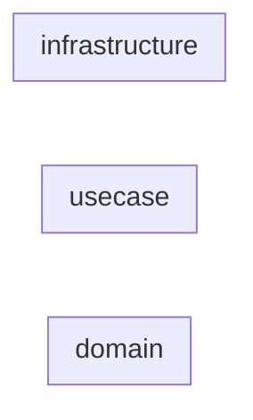

<!-- Generated contract-map-renderer — DO NOT EDIT DIRECTLY -->
<!-- OS-06 DEFERRED: v3 rendering pipeline requires ADR-level design decisions. Full implementation tracked as T012. -->

```mermaid
flowchart LR
    %% contract-map renderer is OS-06 deferred (track tddd-v2-2026-05-08).
    %% v3 schema redesign requires ADR-level design decisions and is tracked separately as T012.
    %% Until then, this renderer outputs only the layer scaffold.
    subgraph domain [domain]
        %% 80 entries (nodes deferred to T012)
    end
    subgraph usecase [usecase]
        %% 9 entries (nodes deferred to T012)
    end
    subgraph infrastructure [infrastructure]
        %% 47 entries (nodes deferred to T012)
    end
```
