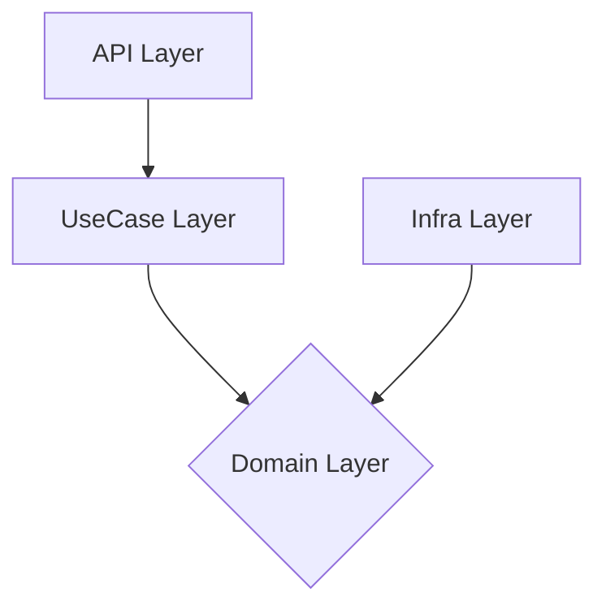

# Project Workflow (Rust)

## Guiding Principles

`START_HERE_HUMAN.md` は人間向けの最初の入口として扱う。

1. **仕様が真実の源泉**: すべての作業は `track/items/<id>/spec.md` から始まる
2. **型が嘘をつかない**: 実装前に型設計（ドメイン型・エラー型・トレイト）を確定する
3. **テスト駆動**: 実装前にテストを書く（TDD: Red → Green → Refactor）
4. **Tech Stack 厳守**: `track/tech-stack.md` の `TODO:` を0件にしてから実装を開始する
5. **Context 効率**: specialist capability（`planner` / `researcher` / `reviewer` / `debugger` / `multimodal_reader`）を活用して主コンテキストを汚染しない
6. **CI グリーン**: `cargo make ci`（docker compose内実行）が通らない限りコミットしない
7. **No Panics in Production**: `unwrap()` は本番コードでは使用しない
8. **Rust Edition 2024**: 新規コードは Rust Edition 2024 前提で作成する
9. **Layer 強制**: workspace の層依存ルールは `docs/architecture-rules.json` を真実の源泉として常に維持する
10. **外部長文ガイドの節約参照**: 深い外部指針が必要な時は `docs/external-guides.json` と `docs/EXTERNAL_GUIDES.md` を先に確認し、必要時だけ原文キャッシュを読む
11. **自己修復優先**: 実装が 3 回以上詰まった時は即 ABORT せず、debug/research フェーズで原因を切り分ける
12. **レビューサーフェース最小化**: タスク単位でレビュー→コミットする。一括実装後の大量 diff レビューは避ける。レビューコストはコード量の二乗に近似するため（読解量 O(N) × 指摘数 O(N)）、M 分割で O(N^2/M) に削減できる

## Task Workflow

Specialist capability の実体は `.claude/agent-profiles.json` で決まる。既定 profile では `planner` / `reviewer` / `debugger` が Codex、`researcher` / `multimodal_reader` が Gemini、`implementer` が Claude Code に割り当てられる。

### Standard Task Process

1. **タスク選択**: `track/items/<id>/plan.md` の次のタスクを選ぶ
2. **Tech Stack 完了確認**: `track/tech-stack.md` の `TODO:` が残っていないことを確認する
3. **型・インターフェース設計**: 実装前にドメイン型とトレイトを設計する
4. **テスト作成（Red）**: テストを書き、失敗を確認する
5. **実装（Green）**: テストを通す最小限のコードを書く
6. **リファクタリング**: `cargo make fmt` と `cargo make clippy` を適用する
7. **詰まりの切り分け**: コンパイルエラーや失敗テストが続く場合は active profile の `debugger` / `researcher` capability と外部ガイド要約を使って debug/research を行う
8. **レビュー**: `reviewer` capability でレビュー。目標 <500 行/レビュー。5 round 超えたらタスク分割を検討する
9. **品質ゲート**: `cargo make ci` を通す
10. **コミット**: `/track:commit <message>` を使う

`metadata.json` SSoT のタスク状態遷移や workflow traceability は
`TRACK_TRACEABILITY.md` を参照する。

`track/registry.md` の更新タイミングも `TRACK_TRACEABILITY.md` に従う。

### Project Bootstrap Process (初回または技術選定変更時)

1. `/track:catchup` で環境構築 + track setup + プロジェクト状態確認をまとめて行う
2. `/track:plan <feature>` で技術調査・version baseline・tech-stack.md 確定・計画作成・承認後のトラック成果物作成までを行う
3. `track/tech-stack.md` の `TODO:` は `/track:plan` 内で解消する
4. 承認後に自動的にトラック成果物が作成され、実装フェーズへ進む

補足:

- `/track:plan`, `/track:implement`, `/track:review`, `/track:full-cycle` では、ユーザープロンプトと最新トラックの `spec.md` / `plan.md` を走査し、`docs/external-guides.json` の `trigger_keywords` に一致した要約が自動で追加コンテキストに注入される
- 層依存ルールを変更する場合は `docs/architecture-rules.json` を起点に `deny.toml` を更新する（`cargo make check-layers` で検証）

### トラック成果物の作成

`/track:plan <feature>` はユーザー承認後に `track/items/<id>/` にトラック成果物を作成する：
- `metadata.json` (SSoT), `plan.md` (rendered view), `spec.md`, `verification.md`
- `cargo make ci` は `verify-track-metadata` と `verify-tech-stack` を実行する
- そのため、テンプレート例として空のサンプルトラックをコミットしてはいけない
- `track/tech-stack.md` の `TODO:` を解消してからトラック成果物を作成する

### Phase Checkpoint (必要に応じて)

- `cargo make ci`（docker compose内実行）で全チェック通過を確認する
- ユーザーに手動検証手順を提示して確認を求める
- 結果を `track/items/<id>/verification.md` に追記する
- チェックポイントコミットを作成: `track(checkpoint): End of Phase X`

## Quality Gates

コミット前に必ず `cargo make ci` を通す。

`cargo make ci` では少なくとも次を検証する：

- [ ] `cargo make fmt-check` passes
- [ ] `cargo make clippy` passes (no warnings)
- [ ] `cargo make test` passes (all tests)
- [ ] `cargo make test-doc` passes (doc tests)
- [ ] `cargo make deny` passes
- [ ] `cargo make python-lint` passes
- [ ] `cargo make scripts-selftest` passes
- [ ] `cargo make hooks-selftest` passes
- [ ] `cargo make check-layers` passes
- [ ] `cargo make verify-arch-docs` passes
- [ ] `cargo make verify-plan-progress` passes
- [ ] `cargo make verify-track-metadata` passes
- [ ] `cargo make verify-track-registry` passes
- [ ] `cargo make verify-tech-stack` passes
- [ ] `cargo make verify-orchestra` passes
- [ ] `cargo make verify-canonical-modules` passes
- [ ] `cargo make verify-latest-track` passes
- [ ] `cargo make verify-module-size` passes
- [ ] `cargo make verify-domain-strings` passes
- [ ] `cargo make verify-domain-purity` passes
- [ ] `cargo make verify-usecase-purity` passes
- [ ] `cargo make verify-view-freshness` passes
- [ ] `cargo make verify-spec-coverage` passes

`/track:commit <message>` はユーザー向けの正規コミット経路で、必要なら git note 適用まで含めて処理する。

`cargo make commit` は terminal 直実行用の低レベル代替で、`cargo make ci`（上記すべてを含む）を通したあと `git commit` を実行するが、git note の自動適用は行わない。

自動化用途では exact wrapper も使える。
`cargo make add-all` は worktree 全体を stage し、`tmp/track-commit/*` を含む transient scratch file は除外する。
選択的 staging が必要な場合の正規経路は `tmp/track-commit/add-paths.txt` に path list を書いて `cargo make track-add-paths` を使うこと。
`cargo make track-commit-message` は `tmp/track-commit/commit-message.txt` を commit message として使い、成功後にそのファイルを削除する。
`cargo make track-note` は `tmp/track-commit/note.md` を git note として適用し、成功後にそのファイルを削除する。

補足: `cargo make check` はローカルの高速な型確認用で、`cargo make ci` には含まれない。`cargo make machete` は依存整理時の補助監査として個別に実行する。

アプリ開発の内側ループでは `cargo make ci-rust`（fmt-check + clippy + test + deny + check-layers のみ）を使い、コミット前の最終ゲートは必ず `cargo make ci`（全体 CI）を通す。テンプレート基盤（hooks / scripts）を変更した場合も `cargo make ci` を使う。

## Track Commands

```bash
/track:catchup                 # 環境構築 + 初期化 + 状態ブリーフィング（初回・新規参入時）
/track:setup                  # track ワークフロー初期化のみ（catchup 内で自動実行される）
/track:plan <feature>         # 調査・設計・plan 作成・承認後にトラック成果物作成
/track:plan-only <feature>    # plan/<id> ブランチで計画のみ作成（PR 経由で main に合流、実装ブランチは未作成）
/track:activate <track-id>    # plan-only トラックを実体化してトラックブランチに切り替え
/track:full-cycle <task>      # 自律実装フルサイクル
/track:implement              # 並列実装（対話型）
/track:review                 # 実装レビュー（ローカル Codex CLI）
/track:pr-review              # GitHub PR レビュー（Codex Cloud @codex review）
/track:revert                 # 直近変更の安全な取り消し計画
/track:ci                     # 標準CIチェック
/track:commit <message>       # ガード付きコミット
/track:archive <id>           # 完了トラックをアーカイブ
/track:status                 # 現在の進捗確認
/architecture-customizer      # アーキテクチャ変更専用入口（/track:* とは別系列）
/conventions:add <name>       # Project Conventions に規約文書を追加
```

## plan.md と metadata.json SSoT

`metadata.json`（`schema_version: 3`）がタスク状態の唯一の真実の源泉（SSoT）。
`plan.md` は `cargo make track-sync-views`（`sotp track views sync`）で `metadata.json` から生成される **読み取り専用ビュー** であり、直接編集してはならない。

### 二段階ライフサイクル

`plan.md` と `metadata.json` には初回作成と以降の更新で扱いが異なる：

1. **初回作成**（`/track:plan` の承認後）: `metadata.json` を作成し、`plan.md` は `cargo make track-sync-views` で生成する。初回から SSoT モデルに従う
2. **以降の更新**: タスク状態の変更は `sotp track` サブコマンド経由で `metadata.json` を更新し、`plan.md` は自動再生成される。直接編集は禁止

### 状態遷移 API

状態遷移は `sotp track` サブコマンド（Rust CLI）を経由する：
- `sotp track transition`: タスクの状態遷移（todo → in_progress → done / skipped）
- `sotp track add-task`: 新タスクの追加
- `sotp track set-override` / `clear-override`: トラック全体のブロック/キャンセル
- `sotp track next-task`: 次の作業対象タスクの取得（JSON）
- `sotp track task-counts`: タスク集計の取得（JSON）

対応する `cargo make` wrapper: `track-transition`, `track-add-task`, `track-set-override`, `track-next-task`, `track-task-counts`

CI（`verify-plan-progress`）は `plan.md` と `metadata.json` からのレンダリング結果が一致することを検証する。

### 関連ファイル

- `sotp track` サブコマンド群（Rust CLI）: 状態遷移・ビュー生成の主要実装
- `scripts/track_schema.py`: データモデル・バリデーション（Python、テストスイートから参照。verify 本体は Phase 5 で Rust 化済み）
- `scripts/track_state_machine.py`: レガシー状態遷移 API（Python、テスト用フォールバックのみ残存。production は sotp 必須）

詳細な更新タイミングと commit 前チェックは `TRACK_TRACEABILITY.md` を参照する。

## verification.md

各トラックは `verification.md` を持ち、少なくとも次を記録する。

- 手動検証したスコープ
- 実施手順
- 結果（pass / fail / unresolved）
- 未解決事項
- 検証日時

## Mermaid Diagram Convention

アーキテクチャや依存関係の図示にはMermaidを使う：



## Branch Strategy (Branch-per-Track モデル)

### 概要

各トラックは専用のフィーチャーブランチ `track/<track-id>` で作業を行う。
`main` ブランチへの直接変更は避け、PR ベースのマージワークフローを採用する。

### 現在のトラック解決ロジック

- `track/*` ブランチにいる場合: ブランチ名から対応するトラックを自動解決する（branch-bound）
- `main` ブランチにいる場合: `updated_at` タイムスタンプによる legacy fallback で最新トラックを解決する
- 解決ロジックの実体は `scripts/track_resolution.py` の `resolve_track_dir()` にある

### ブランチの作成

- **自動**: `/track:plan <feature>` がトラック成果物作成時にブランチ `track/<track-id>` を自動作成する
- **plan-only**: `/track:plan-only <feature>` は計画レビュー用の一時ブランチ `plan/<track-id>` を作成する。PR 経由で main にマージした後、`/track:activate <track-id>` で実装ブランチ `track/<track-id>` を作成する
- **手動**: `cargo make track-branch-create '<id>'` で既存トラックに対してブランチを作成できる

### ブランチの切り替え

- `cargo make track-branch-switch '<id>'` で対象トラックのブランチに切り替える

### マージワークフロー（track/ ブランチ）

1. トラックブランチで作業を完了する
2. `cargo make track-pr-push` でブランチを push する
3. `cargo make track-pr-ensure` で PR を作成する
4. CI が通過することを確認する
5. PR をマージする

### マージワークフロー（plan/ ブランチ）

`plan/<id>` ブランチは計画レビュー用の一時ブランチであり、push / PR 作成には明示的なトラック ID が必要。`/track:pr-review` は `plan/` ブランチでは使用不可（`track/<id>` ブランチ専用）。

1. 計画成果物をコミットする
2. `cargo make track-pr-push '<track-id>'` でブランチを push する
3. `cargo make track-pr-ensure '<track-id>'` で PR を作成する
4. PR をレビュー・マージする
5. `/track:activate <track-id>` で実装ブランチを作成する
6. `/track:archive <id>` でトラックをアーカイブする

### PR ベースレビュー（Codex Cloud）

`/track:pr-review` は GitHub PR 上で Codex Cloud の `@codex review` を使った非同期レビューサイクルを実行する。

**前提条件:**
- Codex Cloud GitHub App がリポジトリにインストール済み
- `gh` CLI が認証済み

**フロー:**
1. `cargo make track-pr-push` — トラックブランチを origin に push
2. `cargo make track-pr-ensure` — PR を作成 or 再利用
3. `cargo make track-pr-review` — `@codex review` コメント投稿 → ポーリング → 結果パース

**非同期ポーリング:**
- `@codex review` コメント投稿後、GitHub API をポーリング（デフォルト: 15秒間隔、10分タイムアウト）
- トリガータイムスタンプ以降のレビューのみを検出（古いレビューの誤検出を防止）
- タイムアウト時: bot activity 有無で「GitHub App 未インストール」と「レビュー進行中」を区別

**既存ワークフローとの関係:**
- `/track:review` はローカルの高速レビューループとして引き続き利用可能
- `/track:pr-review` は PR ベースの非同期レビュー（GitHub 上でレビュー履歴が残る）
- 両者は独立しており、用途に応じて使い分ける

### ガードポリシー

直接の `git merge` / `git rebase` / `git cherry-pick` / `git reset` / `git switch` はフックでブロックされる。
ブランチ操作はワークフローラッパー（`cargo make track-branch-*` や `/track:*` コマンド）を経由すること。

## Git Notes (実装トレーサビリティ)

コミットに構造化メモを付与することで、コミットハッシュを変えずに実装の文脈を記録できる。

### 自動生成フロー（正規経路）

`/track:commit <message>` は track context から note を生成し、
`tmp/track-commit/note.md` を `cargo make track-note` で適用する。

### 手動生成

```bash
# 正規経路: /track:commit が生成した scratch file を適用して削除
cargo make track-note

# 低レベル: 短い inline text を直接適用（terminal 直実行用）
cargo make note "note text here"
```

`cargo make track-note` は file-based wrapper（`sotp git note-from-file`）経由で note を適用する。
`cargo make note` は低レベル経路で `git notes add -f -m "$CARGO_MAKE_TASK_ARGS" HEAD` を直接実行する。
自動化フローでは `tmp/track-commit/` を使う file-based wrapper を優先すること。

選択的 staging を自動化する場合は `tmp/track-commit/add-paths.txt` に
repo-relative path を 1 行ずつ書き、`cargo make track-add-paths` を使う。
`cargo make add <files>` は terminal 直実行用の低レベル staging として扱う。

`cargo make commit` を terminal から直接実行した場合は、必要に応じて `cargo make note ...` を別途実行する。
自動化フローの正規経路では `tmp/track-commit/commit-message.txt` を用意して `cargo make track-commit-message` を使う。

### note フォーマット

```markdown
## Task Summary: <brief task description>
**Track:** <track-id>
**Task:** <task name from [x] item in plan.md>
**Date:** YYYY-MM-DD
### Changes
- <filename>: <what changed and why — one line per key file, max 10 bullets>
### Why
<1–3 sentences from spec.md or plan.md rationale>
```

### チーム間での notes 共有

git notes はデフォルトで `git fetch` / `git push` に含まれない。
チーム開発やマシン間で notes を共有するには以下を設定する:

```bash
# clone ごとに一度実行（fetch 時に notes を自動取得）
git config --add remote.origin.fetch "+refs/notes/*:refs/notes/*"

# notes を remote に push
git push origin "refs/notes/*"
```

notes はトレーサビリティの補助情報であり、失われてもワークフローは壊れない。

### 参照コマンド

```bash
git notes list                 # note 一覧
git notes show <commit>        # 特定 commit の note 表示
git log --show-notes           # log に note を含めて表示
```
